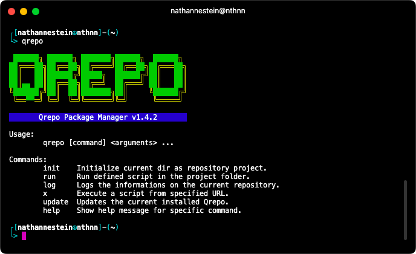

# Qrepo Package Manager


[](https://github.com/nthnn/Qrepo/issues)
[](https://github.com/nthnn/Qrepo/stargazers)
[](https://github.com/nthnn/Qrepo/blob/main/LICENSE)
<a href="https://www.buymeacoffee.com/nthnn"></a>

Simple and easy-to-use all-for-one build tool for AIX, Android, Darwin, Dragonfly, FreeBSD, illumos, iOS, Linux, NetBSD, OpenBSD, Plan9, Solaris, and Windows.

Qrepo is a lightweight and intuitive package and build manager designed to streamline the process of managing project dependencies and scripts. Whether you're working on a small script or a complex software project, Qrepo provides a simple yet powerful set of commands to enhance your development workflow.

<p align="center">
    
</p>

## Installation

For (Linux, macOS, and/or UNIX-based) systems with built-in curl and Bash shell, copy the following command on your terminal to smoothly install Qrepo to your system:

```bash
sh -c "$(curl -fsSL https://raw.githubusercontent.com/nthnn/Qrepo/master/support/install.sh)"
```

To update the current installed Qrepo, you can use the following on your terminal:

```bash
qrepo update
# Or
qrepo x https://raw.githubusercontent.com/nthnn/Qrepo/master/support/install.sh
```

Otherwise, download the binary form from [here](https://github.com/nthnn/Qrepo/releases) if you don't want to build Qrepo yourself.

## Getting Started

1. Initialize your project as a Qrepo repository: `qrepo init`
2. Define scripts in your project's configuration file.
3. Run scripts using: `qrepo run <script-name>`
4. View repository information: `qrepo log`

## Command

- `init`: Initialize the current directory as a Qrepo repository project.
    Example:
    ```bash
    qrepo init
    ```

- `run`: Run a defined script in the project folder.
    Example:
    ```bash
    qrepo run build
    ```

- `log`: Display detailed information on the current repository.
    Example:
    ```bash
    qrepo log
    ```

- `x`: Executes a script from specified URL.
    Example:
    ```bash
    qrepo x https://raw.githubusercontent.com/nthnn/Qrepo/master/support/install.sh
    ```

- `update`: Installs an updated Qrepo.
    Example:
    ```bash
    qrepo update
    ```

- `help`: Show help message for a specific command.
    Example:
    ```bash
    qrepo help
    ```

## Usage

Upon initialization of Qrepo project, it will generate something like this below:

```json
    ...
	"scripts": {
		"test": ["echo No test specified."]
	}
    ...
```

Whence you can run it with `qrepo run test` and it will execute the `echo No test specified` to your shell.

To make a script command for different operating systems and architectures, you can do something like:

```json
    ...
	"scripts": {
		"darwin/amd64:greet":     ["echo Hello from Darwin (AMD64)."],
		"darwin/arm64:greet":     ["echo Hello from Darwin (ARM64)."],
        "linux/386:greet":        ["echo Hello from Linux (i386)"],
        "linux/amd64:greet":      ["echo Hello from Linux (AMD64)"],
		"windows:greet":          ["echo Hello from Windows."],
	}
    ...
```

For instance, you run `qrepo run greet` on Linux with i386, it will print the `Hello from Linux (i386)`. While if you run the command on a Windows with whatever processor, you'll get `Hello from Windows`.

## GitHub Actions

If your project utilizes Qrepo for building or other functions, simply include the Qrepo installation by adding the following step to your GitHub CI/CD workflow pipeline:

```yaml
    ...
      - uses: actions/setup-go@v4
        with:
          go-version: '1.21.2'

      - name: Install Qrepo
        run: sh -c "$(curl -fsSL https://raw.githubusercontent.com/nthnn/Qrepo/master/support/install.sh)"
    ...
```

Utilizing the official Golang GitHub action is essential to bypass the need for brew or apt installations. Also, please note that this step is specifically designed for GitHub CI/CD workflow pipelines and is applicable only to Ubuntu and macOS builds.

## Used By

Below is the list of projects using the Qrepo as package manager and build command line tool.

1. [QLBase](https://github.com/nthnn/QLBase) - Decentralizable, scalable, and reliable backend solution alternative to traditional NoSQL, SaaS, and cloud-based services.
2. [Rheolaeth](https://github.com/nthnn/rheolaeth) - Rheolaeth is a remote tool for controlling shell via HTTP connection using another device in network.
3. [Zync OS](https://github.com/nthnn/Zync-OS) - Mock-up bootloader and kernel-only operating system with a very basic boring shell written in pure Assembly.
4. [ladivic](https://github.com/nthnn/ladivic) - C++ library designed to provide system-level thread- and fail-safe functions with concurrency, atomic, file I/O, IPC, memory management, and system information retrieval functionalities.

## Contributing and Contributors

All contributions are welcome to make Qrepo even better. Whether you want to report a bug, suggest new features, or contribute code, your contributions are highly appreciated.

### Issue Reporting

If you come across a bug, have a feature request, or wish to propose enhancements, we kindly encourage you to initiate the process by opening an issue on our [GitHub Issue Tracker](https://github.com/nthnn/Qrepo/issues).

### Pull Requests

If you're eager to get involved and contribute your coding expertise to Qrepo, thrilled to have you on board! To ensure a smooth and collaborative process, here's an outlined the following steps that you can follow:

1. Fork the Qrepo repository to your GitHub account. And then clone it to your local machine.

    ```bash
    git clone https://github.com/<your username>/Qrepo.git
    ```

2. Create a new branch for your changes:

    ```bash
    git checkout -b feature/<your feature name>
    ```

3. You can now make changes to the repository.
4. Commit your changes:

    ```bash
    git add -A
    git commit -m "Add your meaningful commit message here"
    ```

5. Push your changes to your forked repository:

    ```bash
    git push origin feature/<your feature name>
    ```

6. Create a pull request (PR) from your branch to the main branch of the Qrepo repository.
7. Your PR will be reviewed, and any necessary changes will be discussed and implemented.
8. Once your PR is approved, it will be merged into the main branch, and your contribution will be part of Qrepo.

## Contributors

- [Nathanne Isip](https://github.com/nthnn) - Author, Developer
- [Lady Selene](https://www.instagram.com/lady.selenee/) - Logo Creator, Illustrator

## License

Copyright 2023 - Nathanne Isip

Permission is hereby granted, free of charge, to any person obtaining a copy of this software and associated documentation files (the “Software”), to deal in the Software without restriction, including without limitation the rights to use, copy, modify, merge, publish, distribute, sublicense, and/or sell copies of the Software, and to permit persons to whom the Software is furnished to do so, subject to the following conditions:

The above copyright notice and this permission notice shall be included in all copies or substantial portions of the Software.

THE SOFTWARE IS PROVIDED “AS IS”, WITHOUT WARRANTY OF ANY KIND, EXPRESS OR IMPLIED, INCLUDING BUT NOT LIMITED TO THE WARRANTIES OF MERCHANTABILITY, FITNESS FOR A PARTICULAR PURPOSE AND NONINFRINGEMENT. IN NO EVENT SHALL THE AUTHORS OR COPYRIGHT HOLDERS BE LIABLE FOR ANY CLAIM, DAMAGES OR OTHER LIABILITY, WHETHER IN AN ACTION OF CONTRACT, TORT OR OTHERWISE, ARISING FROM, OUT OF OR IN CONNECTION WITH THE SOFTWARE OR THE USE OR OTHER DEALINGS IN THE SOFTWARE.